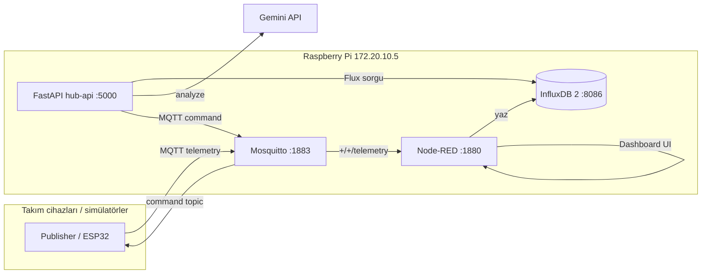

# IoT Hub — Nihai Mimari (Raspberry Pi)

Bu belge, **BLM-0482 IoT simülasyonu** kapsamında Pi üzerinde çalışan merkez hub’ın seçilen teknoloji yığınını ve veri akışını özetler.

## Hedef cihaz

| Öğe | Değer |
|-----|--------|
| Pi | `kutay@172.20.10.5` |
| MQTT | Mosquitto, port **1883**, **anonim** (kullanıcı/parola yok) |
| REST API | FastAPI **hub-api**, port **5000**, systemd `iot-hub-api.service` |
| Zaman serisi | **InfluxDB 2** — org `iot-hub`, bucket `iot_telemetry` |
| Görselleştirme / ETL | **Node-RED** (+ Dashboard, InfluxDB 2 contrib) |
| Karar motoru | **Google Gemini** (opsiyonel); anahtar yoksa **kural tabanlı fallback** |

Ortam değişkenleri: `~/.config/iot-hub/.env` (`IOT_HUB_ENV_FILE` ile override edilebilir).

## Alt problemler (2 adet)

Hub, topic ve API’de `problem_id` ile iki senaryoyu ayırır:

1. **`tarim_sulama`** — nem/sulama; komutlar: `sulama_ac`, `sulama_kapat`
2. **`tarim_havalandirma`** — sıcaklık/hava kalitesi; komutlar: `fan_ac`, `fan_kapat`

Geçerli MQTT kalıpları:

- Telemetri: `{problem_id}/{takim_no}/telemetry`
- Komut: `{problem_id}/{takim_no}/command`

Örnek: `tarim_sulama/7/telemetry`

## Bileşen diyagramı



## Veri akışı

1. Takımlar JSON telemetri yayınlar (`sensor`, `sicaklik`, `nem`, `hava_kalitesi`, `problem_id`, `takim_no`, `timestamp`).
2. Node-RED `+/+/telemetry` aboneliği ile mesajları alır, ayırır (DS18B20 / DHT11), Dashboard’da gösterir ve InfluxDB 2’ye yazar (`measurement=telemetry`, tag’ler: `problem_id`, `takim_no`, `sensor`).
3. **hub-api** `/analyze` ile son N dakikalık kayıtları Influx’tan okur; Gemini veya fallback kurallarıyla `aksiyon`, `sure_sn`, `gerekce` üretir.
4. `/command` veya analiz sonrası otomasyon, `{problem_id}/{takim_no}/command` konusuna JSON komut gönderir.

## hub-api uç noktaları

| Metot | Yol | Açıklama |
|--------|-----|----------|
| GET | `/health` | Servis, Influx/Gemini yapılandırma özeti |
| POST | `/analyze` | Gövde: `problem_id`, `takim_no`, `window_min` |
| GET | `/history/{problem_id}/{takim_no}` | Son telemetri listesi |
| POST | `/command` | MQTT komut yayını |

Kaynak kod: `raspi/hub-api/` → Pi’de `/home/kutay/hub-api`.

## Kurulum scriptleri

`raspi/scripts/` dizininde:

| Script | Nerede çalışır | Görev |
|--------|----------------|--------|
| `install_influxdb.sh` | Pi | apt `influxdb2`, `influx setup`, bucket, token → `~/.config/iot-hub/` |
| `install_hub_api.sh` | Pi | venv, pip, systemd enable/restart |
| `install_nodered_influx.sh` | Pi | `node-red-contrib-influxdb` |
| `deploy_to_pi.sh` | Mac | scp hub-api, flows, functions; uzak kurulum |
| `test_hub.sh` | Mac veya Pi | health, analyze, MQTT, Influx/history smoke test |

Typical sıra (Pi’de bir kez):

```bash
./install_influxdb.sh
./install_nodered_influx.sh
```

Mac’ten deploy:

```bash
export PI_HOST=172.20.10.5 PI_USER=kutay
# İsteğe bağlı test: export PI_SSH_PASSWORD=kutay123
./deploy_to_pi.sh
./test_hub.sh
```

Node-RED akış dosyası: `raspi/node-red/flows_hub_complete.json` (deploy hedefi: `~/.node-red/flows.json`). Dosya yoksa deploy yedek olarak `flows_flow1_fixed.json` kullanır.

## Güvenlik notları (simülasyon)

- MQTT **anonim** — sadece kapalı ağ / sınıf ortamı için uygundur.
- Influx token ve `GEMINI_API_KEY` yalnızca `~/.config/iot-hub/.env` ve `influx-admin.token` içinde; repoya commit etmeyin.
- Üretimde TLS, MQTT kullanıcıları ve Influx RBAC düşünülmelidir.

## İlgili dosyalar

- `hub-api/main.py`, `gemini_client.py`, `influx_client.py`, `mqtt_client.py`
- `hub-api/iot-hub-api.service`
- `node-red/FUNCTION_VERIYI_AYIR.js`
- Eski dinleyici (opsiyonel): `mqtt_hub_listener.py`
